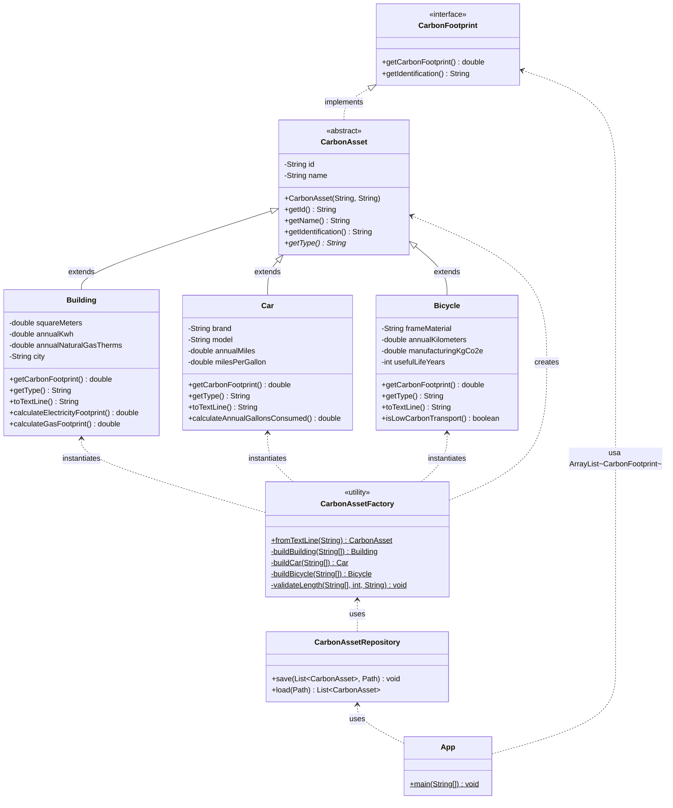

# Huella de Carbono en Java

## 1. Descripción general

Este proyecto fue desarrollado como caso de estudio para aplicar conceptos básicos de programación orientada a objetos en Java. El programa calcula la huella de carbono anual de diferentes elementos: un edificio, un carro y una bicicleta.

La idea principal es que cada objeto tenga una forma diferente de calcular su huella de carbono, pero todos puedan manejarse mediante una misma interfaz llamada `CarbonFootprint`. De esta manera se evidencia el uso de polimorfismo, herencia, reutilización de código, modularidad, manejo de archivos y pruebas unitarias.

El ejercicio está basado en el caso propuesto por Deitel y Deitel sobre huella de carbono.

---

## 2. Objetivo del programa

Desarrollar una aplicación en Java que permita:

- Crear objetos de tipo `Building`, `Car` y `Bicycle`.
- Calcular la huella de carbono anual de cada objeto.
- Guardar la información de los objetos en un archivo de texto.
- Leer nuevamente los objetos desde el archivo.
- Ejecutar pruebas unitarias para comprobar que los cálculos y el manejo de archivos funcionan correctamente.

---

## 3. Conceptos de POO aplicados

### Herencia

Se creó una clase abstracta llamada `CarbonAsset`, que contiene atributos comunes como `id` y `name`. Las clases `Building`, `Car` y `Bicycle` heredan de esta clase.

Esto evita repetir código y permite centralizar validaciones comunes.

### Polimorfismo

El programa utiliza un `ArrayList<CarbonFootprint>` para almacenar objetos de diferentes clases. Aunque cada clase calcula la huella de carbono de forma distinta, todas responden al método `getCarbonFootprint()`.

Ejemplo usado en el programa:

```java
ArrayList<CarbonFootprint> carbonObjects = new ArrayList<>(assets);
```

### Abstracción

La interfaz `CarbonFootprint` define los métodos que deben implementar las clases que calculan huella de carbono:

```java
double getCarbonFootprint();
String getIdentification();
```

### Encapsulamiento

Los atributos de las clases son privados y se accede a ellos mediante métodos públicos. Esto protege la información interna de cada objeto.

### Modularidad

El proyecto está separado por responsabilidades:

- `model`: contiene las clases principales del dominio.
- `repository`: contiene el manejo de archivos.
- `App`: contiene la ejecución principal.
- `test`: contiene las pruebas unitarias.

---

## 4. Estructura del proyecto

```text
carbon-footprint-java
├── data
│   └── carbon_objects.txt
├── docs
│   └── diagrama_uml.png
├── src
│   ├── main
│   │   └── java
│   │       └── edu
│   │           └── carbonfootprint
│   │               ├── App.java
│   │               ├── model
│   │               │   ├── Bicycle.java
│   │               │   ├── Building.java
│   │               │   ├── Car.java
│   │               │   ├── CarbonAsset.java
│   │               │   ├── CarbonAssetFactory.java
│   │               │   ├── CarbonFootprint.java
│   │               │   └── EmissionFactors.java
│   │               └── repository
│   │                   └── CarbonAssetRepository.java
│   └── test
│       └── java
│           └── edu
│               └── carbonfootprint
│                   ├── model
│                   └── repository
└── pom.xml
```

---

## 5. Diagrama UML

El siguiente diagrama muestra las clases principales del proyecto y sus relaciones:



Relaciones principales:

- `CarbonFootprint` es una interfaz.
- `CarbonAsset` es una clase abstracta que implementa la interfaz.
- `Building`, `Car` y `Bicycle` heredan de `CarbonAsset`.
- `CarbonAssetRepository` se encarga de guardar y leer objetos en archivo de texto.
- `CarbonAssetFactory` reconstruye los objetos desde las líneas guardadas en el archivo.

---

## 6. Fórmulas usadas

### Building

El edificio calcula su huella de carbono a partir del consumo anual de electricidad y gas natural.

```text
huella = kWhAnuales * 0.394 + termiasGasNatural * 5.30
```

### Car

El carro calcula primero los galones consumidos en el año y luego estima las emisiones.

```text
galones = millasAnuales / millasPorGalon
huella = galones * 8.89 / 0.994
```

### Bicycle

La bicicleta no usa combustible durante su operación. Por eso se calcula una huella anual aproximada a partir de la fabricación y los años de vida útil.

```text
huella = kgCO2eFabricacion / añosVidaUtil
```

---

## 7. Manejo de archivos

El programa guarda los objetos en un archivo de texto ubicado en:

```text
data/carbon_objects.txt
```

Cada línea del archivo representa un objeto. Por ejemplo:

```text
BUILDING|B-001|Edificio Administrativo|1200.0|18000.0|320.0|Bogota
CAR|C-001|Vehiculo Familiar|Toyota|Corolla|10500.0|32.0
BICYCLE|BI-001|Bicicleta Urbana|Aluminio|2800.0|160.0|10
```

Para separar los datos se usa el carácter `|`. Después, la clase `CarbonAssetFactory` interpreta cada línea y crea nuevamente el objeto correspondiente.

---

## 8. Pruebas unitarias

Las pruebas se encuentran en la carpeta:

```text
src/test/java
```

Clases de prueba incluidas:

| Clase de prueba | Qué valida |
|---|---|
| `BuildingTest` | Cálculo de huella de carbono del edificio y validación de datos negativos. |
| `CarTest` | Cálculo de huella de carbono del carro y validación de rendimiento inválido. |
| `BicycleTest` | Cálculo de huella anual de la bicicleta y validación de vida útil. |
| `CarbonAssetRepositoryTest` | Escritura y lectura de objetos en archivo de texto. |

Para ejecutar todas las pruebas con Maven:

```bash
mvn test
```
---

## 9. Resultado esperado

Al ejecutar el programa se obtiene un reporte similar al siguiente:

```text
=== Reporte polimorfico de huella de carbono ===
BUILDING [id=B-001, name=Edificio Administrativo] -> 8788.00 kg CO2e/anio
CAR [id=C-001, name=Vehiculo Familiar] -> 2934.64 kg CO2e/anio
BICYCLE [id=BI-001, name=Bicicleta Urbana] -> 16.00 kg CO2e/anio

Objetos almacenados en: .../data/carbon_objects.txt

=== Objetos leidos desde archivo ===
BUILDING [id=B-001, name=Edificio Administrativo] -> 8788.00 kg CO2e/anio
CAR [id=C-001, name=Vehiculo Familiar] -> 2934.64 kg CO2e/anio
BICYCLE [id=BI-001, name=Bicicleta Urbana] -> 16.00 kg CO2e/anio
```

---

## 10. Explicación de la solución

Primero se analizaron los objetos del caso de estudio: edificio, carro y bicicleta. Cada uno tiene características propias y una forma diferente de calcular la huella de carbono. Luego se diseñó una interfaz común llamada `CarbonFootprint`, para obligar a que todos los objetos tengan el método `getCarbonFootprint()`.

Después se creó la clase abstracta `CarbonAsset`, que permite reutilizar atributos y métodos comunes. Con esto se evita repetir código en las clases hijas. Las clases `Building`, `Car` y `Bicycle` heredan de `CarbonAsset` y cada una implementa su propio cálculo.

Para el manejo de archivos se creó `CarbonAssetRepository`, separando esta responsabilidad de las clases del modelo. Así se aplica el principio de responsabilidad única. Además, se creó `CarbonAssetFactory` para reconstruir objetos a partir del archivo de texto.

Finalmente, se agregaron pruebas unitarias con JUnit para comprobar que los cálculos principales funcionan y que los objetos pueden guardarse y leerse correctamente desde archivo.

---
## 11. Link del video

Se adjunta el link del video en youtube con la explicación.

https://youtu.be/ZbJ-g-kllbI

---

## 12. Link del repositorio

Se adjunta el link del repositorio en GitHub.

https://github.com/DanieHG10/Taller-Java-Carbon

---
## 13. Conclusión

Se permite evidenciar la aplicación de los conceptos principales de la programación orientada a objetos. La solución usa herencia, interfaces, polimorfismo, encapsulamiento y separación por paquetes. Además, incluye persistencia en archivo de texto y pruebas unitarias para validar el comportamiento de las clases principales.
